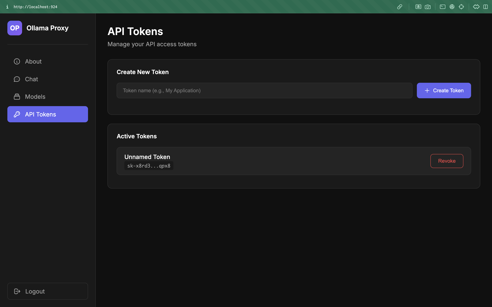

# Ollama Proxy with WebUI

[](https://hub.docker.com/)
[](https://opensource.org/licenses/MIT)
[](https://ollama.ai/)
[](https://platform.openai.com/)

A lightweight, production-ready proxy server for Ollama with a beautiful web management interface. No bloat, just what you need.



## ✨ Why This Project?

- **Lightweight** - Single container, minimal dependencies
- **OpenAI Compatible** - Drop-in replacement for OpenAI API
- **Token Management** - Create API keys for your apps without exposing your server
- **Beautiful UI** - Modern dark theme, responsive design
- **Self-hosted** - Your data stays on your server

## Features

- 🎨 **Modern WebUI** - Clean, responsive web interface for managing everything
- 💬 **Interactive Chat** - Chat with any Ollama model directly in the browser
- 📦 **Model Management** - Download and delete models with real-time progress
- 🔑 **API Token Management** - Create and revoke API tokens for secure access
- 🔒 **Password Protection** - Secure login system with session management
- 🔄 **OpenAI Compatible** - API endpoint compatible with OpenAI's format
- 🐳 **Docker Ready** - Easy deployment with Docker Compose

## Quick Start

### 1. Clone and Configure

```bash
# Edit docker-compose.yml to set your password
environment:
  - WEBUI_PASSWORD=your_secure_password_here
```

### 2. Build and Run

```bash
docker-compose up -d --build
```

### 3. Access the WebUI

Open your browser and navigate to:
```
http://localhost:924
```

Login with the password you set in `docker-compose.yml`.

## Usage

### WebUI

1. **About Page** - Overview of features and API documentation
2. **Chat** - Select a model and start chatting
3. **Models** - Download new models or delete existing ones
4. **API Tokens** - Create and manage API access tokens

### API Endpoint

The API is compatible with OpenAI's chat completions format:

```bash
curl -X POST http://localhost:924/v1/chat/completions \
  -H "Content-Type: application/json" \
  -H "Authorization: Bearer YOUR_API_TOKEN" \
  -d '{
    "model": "llama3.2",
    "messages": [
      {"role": "user", "content": "Hello!"}
    ],
    "stream": false
  }'
```

### Popular Models

Download these models from the Models page:
- `llama3.2` - Meta's latest Llama model
- `qwen2.5:0.5b` - Lightweight but capable
- `codellama` - Optimized for code
- `mistral` - Great general-purpose model
- `phi3` - Microsoft's compact model

## Configuration

### Environment Variables

| Variable | Description | Default |
|----------|-------------|---------|
| `WEBUI_PASSWORD` | Password for WebUI login | `admin` |

### Ports

| Port | Service |
|------|---------|
| 924 | WebUI and API |
| 11434 | Ollama direct access (optional) |

### Volumes

| Volume | Purpose |
|--------|---------|
| `ollama-data` | Persist downloaded models |
| `ollama-tokens` | Persist API tokens |

## File Structure

```
ollama-proxy/
├── Dockerfile              # Docker image build file
├── docker-compose.yml      # Docker Compose configuration
├── package.json            # Node.js dependencies
├── server.js               # Node.js server with WebUI
├── public/                 # WebUI static files
│   └── index.html          # Main WebUI page
├── start.sh                # Container startup script
└── README.md               # This document
```

## Security Notes

- Always change the default password before deploying to production
- API tokens are stored persistently and survive container restarts
- Use HTTPS in production (configure a reverse proxy like nginx or traefik)
- Tokens are displayed only once when created - save them securely

## Architecture

```
┌─────────────────────────────────────────────────┐
│                  Container                       │
│  ┌───────────────────────────────────────────┐  │
│  │           Node.js Server (924)             │  │
│  │  ┌─────────┐  ┌─────────┐  ┌───────────┐  │  │
│  │  │  WebUI  │  │   API   │  │   Auth    │  │  │
│  │  └────┬────┘  └────┬────┘  └─────┬─────┘  │  │
│  │       │            │             │        │  │
│  │       └────────────┼─────────────┘        │  │
│  │                    │                       │  │
│  └────────────────────┼───────────────────────┘  │
│                       │                          │
│  ┌────────────────────▼───────────────────────┐  │
│  │           Ollama Server (11434)            │  │
│  │         (Local AI Model Runtime)           │  │
│  └────────────────────────────────────────────┘  │
└─────────────────────────────────────────────────┘
```

## Troubleshooting

### View container status
```bash
docker ps
```

### View logs
```bash
docker-compose logs -f
```

### Restart container
```bash
docker-compose restart
```

### Clean rebuild
```bash
docker-compose down -v
docker-compose up -d --build
```

## License

MIT License
